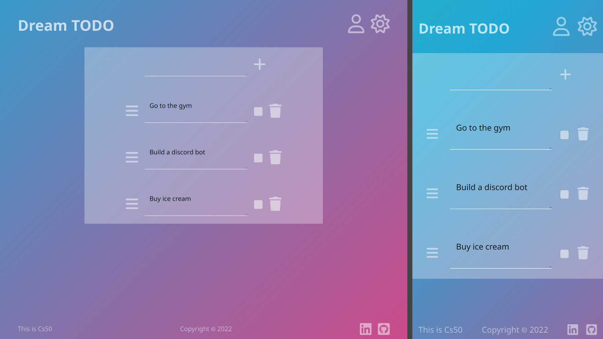

# Dream-TODO

###### cs50 final project

#### Video Demo: <URL HERE>

#### Live url: https://dreamtodo.up.railway.app/

#### Description:

Easy to use TODO list that keeps you organized, your TODOs saved and available through any device browser.
Beautiful and reliable:

Drag and drop to reorder your TODOs, keeping what you need the way you want.
{GIF}

No need to save, it auto syncs.
{GIF}

##### Features:

- Register/Login

- Data persistence

- Auto sync

- Todos Reordering via Drag and Drop

- 100% responsive

- Light/Dark mode

##### Techs used:

- Django
- Jquery
- Ajax
- Bootstrap
- Sass

##### Extra tools:

- Font Awesome
- [Favicon.io](favicon.io)

##### deployed via: https://railway.app/

### Challenges

This project was a big challenge for me mostly because i've never user the Django witch is a backend framework and because i did not used any frontend framework, so i had to rely in jquery and jinja templates witch i think is not ideal, anyways it worked well and the result was satisfying for me. Lets run trough some specific challenges:

##### Register/Login:

asd ferq asd ferq asd ferq asd ferq asd ferq asd ferq asd ferq asd ferq asd ferq asd ferq asd ferq asd ferq asd ferq asd ferq asd ferq asd ferq asd ferq asd ferq asd ferq asd ferq asd ferq asd ferq asd ferq

##### Data persistence:

asd ferq asd ferq asd ferq asd ferq asd ferq asd ferq asd ferq asd ferq asd ferq asd ferq asd ferq asd ferq asd ferq asd ferq asd ferq asd ferq asd ferq asd ferq asd ferq asd ferq asd ferq asd ferq asd ferq

##### Todos Reordering via Drag and Drop:

asd ferq asd ferq asd ferq asd ferq asd ferq asd ferq asd ferq asd ferq asd ferq asd ferq asd ferq asd ferq asd ferq asd ferq asd ferq asd ferq asd ferq asd ferq asd ferq asd ferq asd ferq asd ferq asd ferq

##### 100% responsive:

asd ferq asd ferq asd ferq asd ferq asd ferq asd ferq asd ferq asd ferq asd ferq asd ferq asd ferq asd ferq asd ferq asd ferq asd ferq asd ferq asd ferq asd ferq asd ferq asd ferq asd ferq asd ferq asd ferq

##### Light/Dark mode:

asd ferq asd ferq asd ferq asd ferq asd ferq asd ferq asd ferq asd ferq asd ferq asd ferq asd ferq asd ferq asd ferq asd ferq asd ferq asd ferq asd ferq asd ferq asd ferq asd ferq asd ferq asd ferq asd ferq
